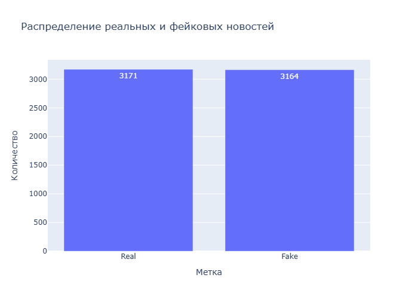
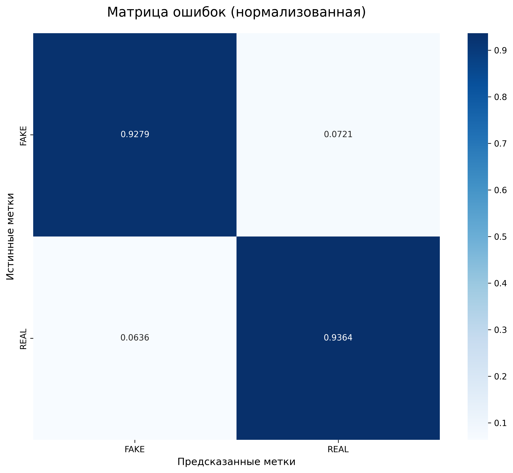
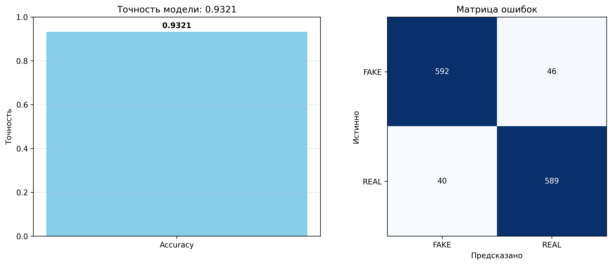

# Обнаружение фейковых новостей 📰🔍

Проект машинного обучения для обнаружения фейковых новостей с использованием TF-IDF и Passive Aggressive Classifier. Проект предоставляет полный рабочий процесс для обучения, оценки и использования модели для классификации новостей как реальных или фейковых.

## 📋 Содержание

- [Возможности](#возможности)
- [Структура проекта](#структура-проекта)
- [Установка](#установка)
- [Быстрый старт](#быстрый-старт)
- [Использование](#использование)
- [Методология](#методология)
- [Результаты](#результаты)
- [Визуализации](#визуализации)
- [Содействие](#содействие)
- [Лицензия](#лицензия)
- [Контакты](#контакты)

## 🚀 Возможности

- **Автоматическая загрузка данных**: Скачивание и предобработка датасета новостей
- **Векторизация TF-IDF**: Преобразование текста в числовые признаки
- **Passive Aggressive Classifier**: Онлайн-алгоритм обучения для адаптации в реальном времени
- **Комплексная визуализация**: Матрица ошибок, метрики и графики распределения
- **Простой API**: Удобный интерфейс для обучения и предсказания
- **Профессиональная структура**: Организованный код, следующий лучшим практикам

## 📁 Структура проекта

```
fake_news_detection/
├── data/
│   └── raw/                    # Хранилище датасета
├── docs/                       # Документация
├── reports/
│   └── figures/                # Сгенерированные визуализации
├── src/                        # Исходный код
│   ├── __init__.py            # Инициализация пакета
│   ├── data_loader.py         # Загрузка и предобработка данных
│   ├── model.py               # Определение модели и обучение
│   └── utils.py               # Утилиты визуализации
├── tests/                      # Unit-тесты (будут добавлены)
├── .gitignore                  # Git ignore файл
├── CODE_OF_CONDUCT.md          # Руководство для сообщества
├── CONTRIBUTING.md             # Руководство по внесению вклада
├── LICENSE                     # Лицензия MIT
├── main.py                     # Основной скрипт обучения
├── README.md                   # Этот файл
├── RELEASE_NOTES.md            # История версий
├── requirements.txt            # Зависимости Python
└── _config.yml                 # Конфигурация Jekyll
```

## 🔧 Установка

### Предварительные требования

- Python 3.7 или выше
- pip пакетный менеджер

### Установка зависимостей

```bash
# Клонирование репозитория
git clone https://github.com/GZGef/fake_news_detection.git
cd fake_news_detection

# Установка необходимых пакетов
pip install -r requirements.txt
```

### Опционально: Установка для разработки

```bash
# Установка в режиме разработки
pip install -e .

# Установка дополнительных инструментов для разработки
pip install pytest black flake8
```

## 🚀 Быстрый старт

### Базовое использование

```python
from src import DataLoader, FakeNewsDetector

# Загрузка и предобработка данных
data_loader = DataLoader()
data_loader.load_dataset()
data_loader.preprocess()

# Получение текста и меток
texts, labels = data_loader.get_text_label_columns()

# Инициализация и обучение модели
model = FakeNewsDetector()
x_train, x_test, y_train, y_test = model.prepare_data(texts, labels)
model.train(x_train, y_train)

# Оценка
metrics = model.evaluate(x_test, y_test)

# Предсказание на новом тексте
prediction = model.predict_single("Ваш текст новости...")
print(f"Предсказание: {prediction}")
```

### Запуск полного рабочего процесса

```bash
python main.py
```

Это выполнит:
1. Скачивание и предобработку датасета
2. Обучение модели
3. Генерацию визуализаций
4. Тестирование на примерах
5. Сохранение результатов в `reports/figures/`

## 📖 Использование

### 1. Загрузка данных

```python
from src import DataLoader

# Инициализация с кастомным URL (опционально)
data_loader = DataLoader(
    data_url="https://example.com/dataset.csv"
)

# Загрузка датасета
data_loader.load_dataset(save_path="data/raw/fake_news.csv")

# Предобработка
data_loader.preprocess()

# Получение текста и меток
texts, labels = data_loader.get_text_label_columns()
```

### 2. Обучение модели

```python
from src import FakeNewsDetector

# Инициализация модели
model = FakeNewsDetector(
    max_iter=50,      # Максимальное количество итераций
    random_state=7    # Для воспроизводимости
)

# Подготовка данных
x_train, x_test, y_train, y_test = model.prepare_data(
    texts, labels, test_size=0.2
)

# Обучение модели
model.train(x_train, y_train)
```

### 3. Оценка

```python
# Оценка на тестовом наборе
metrics = model.evaluate(x_test, y_test)

# Доступ к отдельным метрикам
accuracy = metrics['accuracy']
confusion_matrix = metrics['confusion_matrix']
classification_report = metrics['classification_report']
```

### 4. Визуализация

```python
from src.utils import (
    plot_label_distribution,
    plot_confusion_matrix,
    plot_training_metrics,
    print_classification_report,
)

# График распределения меток
plot_label_distribution(labels, save_path="reports/figures/label_distribution.png")

# Матрица ошибок
y_pred = model.predict(x_test)
plot_confusion_matrix(y_test, y_pred, save_path="reports/figures/confusion_matrix.png")

# График метрик
plot_training_metrics(metrics, save_path="reports/figures/metrics.png")

# Форматированный отчет
print_classification_report(metrics)
```

### 5. Предсказание

```python
# Предсказание для одного текста
text = "Сенсационные новости: Ученые открыли новый вид..."
prediction = model.predict_single(text)
print(f"Предсказание: {prediction}")  # "Ложь" или "Правда"

# Предсказание для нескольких текстов
texts = ["Текст 1", "Текст 2", "Текст 3"]
predictions = model.predict(pd.Series(texts))
```

## 🧠 Методология

### TF-IDF Vectorizer

**TF-IDF (Term Frequency-Inverse Document Frequency)** — статистическая мера, используемая для оценки важности слова в документе относительно коллекции документов.

- **TF (Term Frequency)**: Измеряет, как часто слово встречается в документе
- **IDF (Inverse Document Frequency)**: Оценивает вес слова на основе его распространенности в документах

**Почему TF-IDF?**
- Захватывает важность слов
- Эффективно обрабатывает распространенные слова
- Работает хорошо с классификацией текстов

### Passive Aggressive Classifier

**Passive-Aggressive Classifier** — алгоритм онлайн-обучения, идеально подходящий для потоковых данных и динамических систем.

**Ключевые характеристики:**
- **Passive**: Если классификация правильная, вносятся минимальные изменения
- **Aggressive**: Если ошибка, модель корректируется с максимальной жесткостью

**Преимущества:**
- Быстрая адаптация к новым данным
- Подходит для приложений в реальном времени
- Эффективен с большими наборами данных
- Не требуется хранить все обучающие данные

### Рабочий процесс

```
1. Загрузка данных
   ↓
2. Предобработка
   ↓
3. TF-IDF преобразование
   ↓
4. Обучение модели
   ↓
5. Оценка
   ↓
6. Визуализация
   ↓
7. Предсказание
```

## 📊 Результаты

Модель обычно достигает **85-95% точности** на тестовом наборе, в зависимости от датасета и гиперпараметров.

### Пример вывода

```
======================================================================
ОБНАРУЖЕНИЕ ФЕЙКОВЫХ НОВОСТЕЙ - ПРОЦЕСС ОБУЧЕНИЯ МОДЕЛИ
======================================================================

[Шаг 1] Загрузка и предобработка датасета...
Размер датасета: (6335, 3)
Столбцы: ['title', 'text', 'label']
Распределение меток:
REAL    3171
FAKE    3164

[Шаг 4] Обучение модели...
Обучение TF-IDF векторизатора...
Обучение классификатора...
Обучение завершено!

[Шаг 5] Оценка модели...
Точность: 0.9274 (92.74%)

Отчет о классификации:
              precision    recall  f1-score   support

        FAKE       0.93      0.92      0.93       638
        REAL       0.92      0.93      0.93       629

    accuracy                           0.93      1267
   macro avg       0.93      0.93      0.93      1267
weighted avg       0.93      0.93      0.93      1267

============================================================
ОТЧЕТ О КЛАССИФИКАЦИИ
============================================================

FAKE:
  Точность:    0.9306
  Полнота:     0.9248
  F1-мера:     0.9277
  Поддержка:   638.0

REAL:
  Точность:    0.9242
  Полнота:     0.9300
  F1-мера:     0.9271
  Поддержка:   629.0

Общая точность: 0.9274
============================================================
```

## 📊 Визуализации

Проект генерирует следующие графики:

### 1. Распределение меток (label_distribution.png)

Показывает баланс между реальными и фейковыми новостями в датасете.



### 2. Матрица ошибок (confusion_matrix.png)

Отображает истинные vs предсказанные метки для оценки производительности модели.



### 3. График метрик (metrics.png)

Визуальное представление точности и матрицы ошибок модели.



## 🤝 Содействие

Мы приветствуем вклад! Пожалуйста, смотрите [CONTRIBUTING.md](CONTRIBUTING.md) для деталей.

### Как внести вклад

1. Форкните репозиторий
2. Создайте ветку для новой функции (`git checkout -b feature/amazing-feature`)
3. Зафиксируйте изменения (`git commit -m 'Add amazing feature'`)
4. Отправьте в ветку (`git push origin feature/amazing-feature`)
5. Откройте Pull Request

### Стандарты кода

- Следуйте руководству PEP 8
- Добавляйте docstrings ко всем функциям/классам
- Пишите тесты для новых функций
- Обновляйте документацию

## 📜 Лицензия

Этот проект лицензирован по лицензии MIT — см. файл [LICENSE](LICENSE) для деталей.

## 📧 Контакты

**Тимофей Крылов** - [timofey.krylov.0206@gmail.com](mailto:timofey.krylov.0206@gmail.com)

**Ссылка на проект**: [https://github.com/GZGef/fake_news_detection](https://github.com/GZGef/fake_news_detection)

## 🙏 Благодарности

- Датасет предоставлен [Yandex Cloud Academy](https://storage.yandexcloud.net/academy.ai/practica/fake_news.csv)
- Создано с помощью [scikit-learn](https://scikit-learn.org/)
- Визуализации созданы с помощью [Plotly](https://plotly.com/) и [Matplotlib](https://matplotlib.org/)

---

**Примечание**: Этот проект предназначен для образовательных целей. Всегда проверяйте информацию из нескольких источников перед принятием решений.